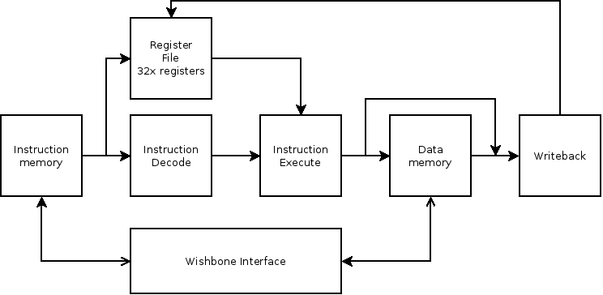

# KPU: FPGA RISC-V CPU on Avnet ZUBoard 1CG

KPU is a compact RISC-V CPU core written in VHDL for FPGA deployment. It fully implements the RV32I base integer ISA (v2.0) and core machine-mode features (Privileged Spec v1.10). Verified as a System-on-Chip on the Avnet 1CG board with example applications; synthesized under Xilinx Vivado 2022.2.

**Institution:** University of Canterbury  
**Supervisor:** Dr Romain Arnal  
**Status:** Work in progress (May 3, 2025)

## Highlights

- RV32I core in VHDL  
- 5-stage pipeline (IF → ID → EX → MEM → WB)  
- Up to 8 maskable external interrupts  
- Optional instruction cache  
- Wishbone B4 bus interface  
- Memory-mapped I/O with basic interrupt support  

## Quick Start

1. Open `kpu.xpr` in Vivado (target: ZUBoard 1CG)  
2. Run synthesis, implementation, and bitstream generation  
3. Program the FPGA and load example binaries from `examples/`  

Licensed under MIT.  
